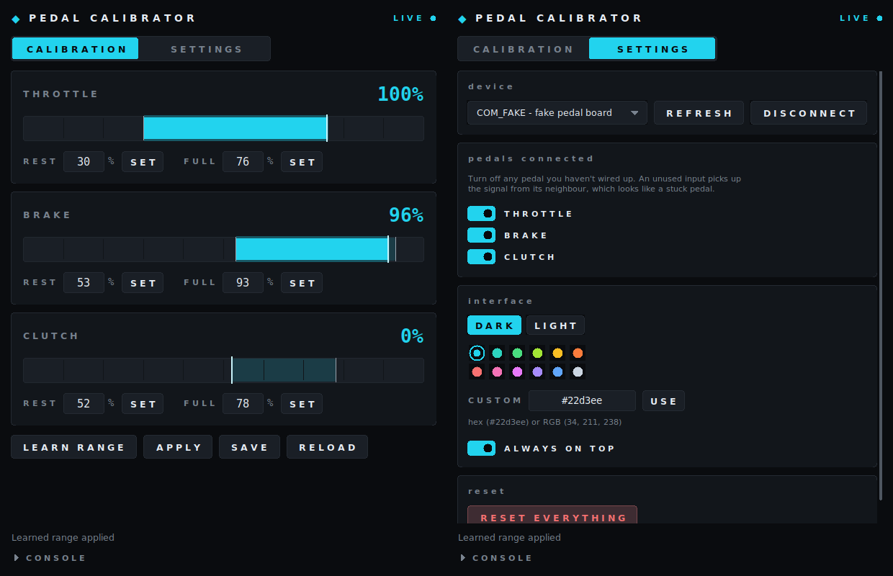

# Sim Pedal Calibrator

A small app that finds your pedal controller on a COM port, shows what each
pedal is actually reading, and lets you set the min and max point of each one.
The calibration is stored on the device, so it survives unplugging.



Calibration and settings tabs. Dark and light themes, twelve accent colours or
any colour you type in, and your choices are remembered.

## Download (Windows)

**[Get PedalCalibrator.exe from the Releases page →](../../releases/latest)**

One file. Nothing to install, no Python needed. Download it, double-click it,
done.

> Windows may show a blue **"Windows protected your PC"** box the first time.
> Click **More info → Run anyway**. That appears for any program that hasn't
> been code-signed, which costs a few hundred dollars a year — most small
> open-source tools skip it.

## Run from source

For development, or on macOS and Linux. Needs **Python 3.10+** — get it from
[python.org/downloads](https://www.python.org/downloads/) and tick
**"Add python.exe to PATH"** on the first installer screen.

**Windows:** double-click `Run Calibrator.bat`. It installs the one dependency
on first run.

**macOS / Linux:** `./run.sh`

**Any platform, from a terminal:**

```bash
pip install -r requirements.txt
python -m pedalcal                 # open the app
python -m pedalcal --list          # just print the ports found
```

There is no single "app file" to open — it's a Python program, so it's started
by one of the launchers above. If you want a true double-clickable `.exe` with
no Python at all, see [Building a Windows .exe](#building-a-windows-exe).

## What's in here

| Path | What it is |
|---|---|
| `pedalcal/` | The desktop app (Python + Tkinter) |
| `firmware/pedal_firmware/` | Arduino sketch for the pedal controller |
| `docs/PROTOCOL.md` | The serial protocol, if you want to talk to the device yourself |
| `pedalcal/theme.py` | Palettes and colour parsing |
| `pedalcal/widgets.py` | The canvas-drawn widget kit |
| `tests/` | Protocol and settings tests, plus a headless GUI smoke test |

## The hardware side

Any Arduino works. If you want the pedals to show up as a **game controller**
in Windows, use a board with native USB — Leonardo, Pro Micro, Micro, or a
Teensy. An Uno or Nano cannot do that, but it can still stream values to this
app.

### Wiring, per pedal

Each pedal needs a sensor that outputs a voltage: a potentiometer, a hall
sensor, or a load cell with an amplifier board.

```
   5V  ─────── sensor VCC   (or pot outer leg 1)
   GND ─────── sensor GND   (or pot outer leg 2)
   A0  ─────── sensor OUT   (or pot wiper)   →  Throttle
   A1  ─────── sensor OUT                    →  Brake
   A2  ─────── sensor OUT                    →  Clutch
```

**Only wiring up two pedals?** Leave the third pin unconnected and switch that
pedal off under **Settings → Pedals connected**. This matters more than it
sounds: an unused analog pin doesn't read zero, it echoes whatever its
neighbour is doing, so an unwired clutch appears to follow the brake. Turning
it off tells the firmware to skip the pin and report a flat zero, and hides the
card so there's nothing confusing left on screen.

### Flashing the firmware

1. Install the [Arduino IDE](https://www.arduino.cc/en/software).
2. Open `firmware/pedal_firmware/pedal_firmware.ino`.
3. *(Optional, native-USB boards only)* Tools → Manage Libraries → search
   **Joystick** → install "Joystick" by Matthew Heironimus. Then uncomment
   `#define USE_JOYSTICK` near the top of the sketch.
4. Tools → Board / Port → pick your board.
5. Click Upload.

## Calibrating

1. Plug the board in and open the app.
2. Go to the **Settings** tab and pick the port. On Windows it's usually the
   one described as *Arduino* or *USB Serial Device*; on Linux `/dev/ttyACM0`;
   on macOS `/dev/cu.usbmodem…`. Switch off any pedal you haven't wired.
3. **Connect** — the dot at the top right turns accent-coloured and reads LIVE.
4. Back on **Calibration**, click **Learn range**, press every pedal all the
   way down and let it back up a couple of times, then **Stop learning**. The
   rest and full points fill in from what it saw.
   *Or* set them by hand: with your foot off the pedal click **Set** under
   Rest, press it fully and click **Set** under Full.
5. Check the readouts — resting should be 0%, fully pressed 100%.
6. Click **Save** to write it to the board's EEPROM.

Everything is in percentages of pedal travel: "rest at 12%, full at 86%" rather
than raw sensor counts. The app converts to whatever the hardware wants.

A tip on brakes: don't set Full at the absolute hardest you can press. Set it
where you want 100% braking to happen, which is usually a bit before the pedal
physically stops.

### What the meter shows

The track is the pedal's whole physical travel, marked off in 10% steps. The
tinted block is the part you've claimed as usable, the solid accent fill is how
far into that block the pedal currently is, and the bright line is where the
sensor sits right now. The big number on the right is what a game would
actually see — 0% with your foot off, 100% at the floor.

## Settings

Everything that isn't calibration lives on the **Settings** tab:

- **Device** — pick the COM port, refresh the list, connect and disconnect.
- **Pedals connected** — switch off anything you haven't wired. Disabled pedals
  vanish from the calibration tab and read a flat zero on the board.
- **Interface** — dark or light, twelve accent swatches, and a **Custom** field
  that takes a colour however you have it: `#22d3ee`, `22d3ee`, `34, 211, 238`
  or `rgb(34, 211, 238)`. Plus **Always on top**, so the window stays visible
  over a running game while you tune.
- **Reset everything** — calibration, pedal selection and appearance back to
  defaults, after a confirmation. Writes to the connected board too.

The **Console** strip at the bottom of the window expands to show the running
log of what the device is saying; leave it collapsed for a cleaner window. All
of this is remembered in `.pedalcal.json` in your user folder.

Every visual element is drawn on a canvas rather than using stock Tk widgets,
so it looks identical on Windows, macOS and Linux. To add colours of your own,
edit `DARK`, `LIGHT` or the `ACCENTS` list in `pedalcal/theme.py` — a palette is
just a dataclass of hex strings, and bright accents are darkened automatically
on the light theme so they stay readable.

## Troubleshooting

**"Another program already has this port open" / Access is denied.**
Only one program can hold a serial port at a time. Close the Arduino IDE's
**Serial Monitor** — that's the cause nine times out of ten. Also close any
second copy of this app, and any other pedal or telemetry software. On Linux,
add yourself to the `dialout` group instead:
`sudo usermod -a -G dialout $USER`, then log out and back in.

**"Connected, but no reply — is the firmware flashed?"**
The port opened but nothing identified itself. Either the sketch isn't
uploaded yet, or you picked the wrong port. Check by opening the Arduino IDE's
Serial Monitor at **115200 baud** — you should see a stream of `D 512 400 300`
lines. If you see nothing, or unreadable characters, re-upload the sketch and
make sure the Serial Monitor's baud rate is 115200.

**The window freezes for a second or two when connecting.** Expected. Most
Arduino boards reboot when a program opens their serial port, so the app waits
for the bootloader before it starts talking. The window stays responsive and
the button says "Cancel" while it happens.

**A pedal moves on its own, or two pedals move together.** That's an unwired
analog pin picking up its neighbour's signal. Switch the unused pedal off under
Settings → Pedals connected.

**The app closes by itself.** It writes what happened to `pedalcal.log` in your
user folder (`C:\Users\<you>\pedalcal.log` on Windows). Open it — the last few
lines will say what failed. That file also records every connection attempt,
which is handy when a port misbehaves.

**Which COM port is it?** Unplug the board, look at the port list, plug it back
in and hit Refresh — the one that appears is yours. Windows sometimes hands out
a different COM number after a reconnect.

## Publishing a release

The included GitHub Actions workflow runs the tests, builds the Windows .exe,
and attaches it to a release — all on GitHub's machines, so you don't need
Python or Windows locally.

```bash
git tag v0.1.0
git push --tags
```

Watch it under the **Actions** tab. A few minutes later the .exe is on your
Releases page. Bump the version number for each new release.

To build one yourself instead:

```bash
pip install pyinstaller
pyinstaller --onefile --windowed --name PedalCalibrator --icon docs/icon.ico run_app.py
```

## Running the tests

```bash
pip install pytest
python -m pytest tests -q    # protocol and settings tests
python tests/smoke_gui.py    # drives the real GUI against a fake board
```

## License

MIT — see [LICENSE](LICENSE).
